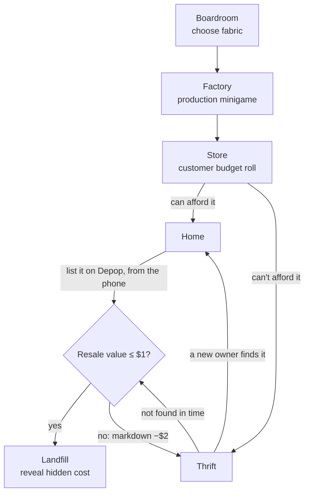

# Loose Threads

**Follow one T-shirt from factory floor to landfill — and watch how every small decision quietly writes its ending.**

## What is Loose Threads?

Loose Threads is a browser-based 3D game about the hidden life of a piece of clothing. You don't play a person — you follow *the shirt itself* as it's manufactured, sold, worn, resold, rejected, marked down, and eventually discarded.

Every choice you make along the way — the fabric it's cut from, how carefully it's made, whether it sells — nudges its resale value and its accumulated hidden cost. Nothing you do is dramatic on its own, but the effects compound: a cheaper fabric decomposes for centuries instead of years, a sloppier production run erodes the price before the shirt even reaches a shelf, a rejected listing sends it back into a markdown spiral it may not climb out of. The game is a small, playable argument about fast fashion — how convenience and low price up front hide a real cost that shows up later, somewhere you don't usually look.

There's one shirt, one continuous journey, and one ending: the landfill. What changes each playthrough is *how* it got there, and what it cost along the way.

## How the Game Works



- **Boardroom** — choose the shirt's fabric: cotton or polyester. This sets its starting price and how long it will take to decompose.
- **Factory** — a production minigame. Missed stitches lower the shirt's price before it ever reaches a shelf; for polyester, misses also quietly cut into a worker's pay.
- **Store** — a customer with a random budget decides whether to buy at the shirt's current price.
- **Home** — the shirt is owned and used. Eventually its owner decides to resell it.
- **Resale (Depop)** — this happens *at Home*, on the owner's phone — it is not a separate physical world. Cropping the listing photos well matters; a sloppy listing lowers the price.
- **Thrift** — if it isn't bought outright, or a resale listing goes stale, the shirt lands on a physical secondhand rack. A potential new owner either finds and takes it (back to Home) or doesn't.
- **The rejection loop** — every time the shirt goes unbought or unfound, its value is marked down and it goes back on the rack for another attempt. This loop is intentional: the shirt keeps getting offered to new owners at a lower price each time.
- **Landfill** — once the value drops to $1 or less, the loop ends. The shirt is discarded, and the game reveals its accumulated hidden cost.

The same shirt persists through the entire experience — there's no separate "run" per scene, just one object moving through a lifecycle.

## Game Logic

The game is driven by a single branching state object, not by independent scenes. The important persistent fields are:

- **`scene`** — which stage of the lifecycle (and which world) is currently active.
- **`material`** — the fabric chosen in the Boardroom (`cotton` | `polyester`).
- **`price`** — the shirt's current resale value. It only ever goes down: minigame misses reduce it, and every thrift/resale rejection marks it down further.
- **`hiddenCost`** — the accumulated externalized cost of the shirt (manufacturing cost, and labor impact for polyester's per-miss wage cuts), revealed at the Landfill ending.
- **`decomposeYears`** — set by the fabric choice, shown at the end.
- **`cycles`** — how many times the shirt has been rejected and re-offered through the thrift loop.

All transitions live in one reducer (`src/game/state.ts`). Every scene component dispatches an action describing what happened (a fabric was chosen, a minigame finished with N misses, an item was or wasn't found); the reducer is the only place that decides what the *next* scene is and how the shirt's numbers change. Scenes never talk to each other directly.

## 3D / Spatial World Workflow

Each location in the game is a real captured/generated environment, not a modeled scene:

- Environments were generated with **World Labs (Marble)**, which exports each one as a Gaussian-splat **`.spz`** file (the visual environment) alongside a **collider `.glb`** (a simplified mesh for collision/raycasting).
- In the browser, the `.spz` is rendered with **[Spark](https://sparkjs.dev)** (`@sparkjsdev/spark`) — World Labs' own Gaussian-splat renderer for Three.js.
- The collider `.glb` is loaded into the same scene but kept invisible (`object.visible = false`); it stays in the scene graph so it's still available for raycasting/collision, it's just never drawn.
- A single shared component, `WorldCanvas.tsx`, mounts the Three.js scene, the Spark renderer, the environment splat, the collider, and (optionally) the shirt model. Switching worlds means re-rendering `WorldCanvas` with a different world key — there's one loading path reused for every location, not a bespoke loader per world.
- `public/worlds/` currently has assets for **seven** environments, but the implemented flow only visits six (`boardroom`, `factory`, `store`, `home`, `resale`, `landfill`) — `depop` is unused, since the resale/Depop interaction happens as a phone overlay at Home rather than its own world.

## T-Shirt Asset

The shirt worn throughout the game — the same asset reused in every scene — was generated with **Mint**. It's an FBX model with an accompanying color texture (`public/models/shirt/`), loaded in the browser with Three's `FBXLoader`. It's a single standalone garment asset with no rig or animation; the game repositions and rescales it per scene rather than swapping models.

## Tech Stack

- **React 18** + **TypeScript** — UI and app state
- **Vite** — dev server and build
- **Three.js** — 3D scene, cameras, `OrbitControls`, `GLTFLoader`, `FBXLoader`
- **[@sparkjsdev/spark](https://sparkjs.dev)** — Gaussian-splat rendering for the World Labs environments
- Plain **`useReducer`** for game state — no external state management, routing, backend, or database

## Project Structure

```
loose-threads/
├── public/
│   ├── worlds/                 # World Labs (Marble) environments: SPZ splat + collider GLB per world
│   │   ├── boardroom/
│   │   ├── factory/
│   │   ├── store/
│   │   ├── home/
│   │   ├── resale/             # used for the physical "Thrift" scene
│   │   └── landfill/
│   ├── models/
│   │   └── shirt/              # Mint-generated shirt asset (FBX + texture)
│   └── flowchart.csv           # source-of-truth game-flow export from Lucidchart
├── src/
│   ├── game/
│   │   ├── types.ts            # GameState, Scene, GameAction types
│   │   ├── state.ts            # reducer: all branching + economy logic
│   │   └── worlds.ts           # per-world asset paths, scene → world map
│   ├── components/
│   │   └── WorldCanvas.tsx     # shared Three.js/Spark scene mount (env + collider + shirt)
│   ├── minigames/
│   │   ├── ClickTimingGame.tsx # reused by Factory and the Depop listing step
│   │   └── FindItemGame.tsx    # used by Thrift
│   ├── Scenes.tsx              # one component per scene (world + UI/minigame)
│   ├── App.tsx                 # reducer wiring, HUD, scene switch
│   ├── index.css
│   └── main.tsx
├── index.html
├── package.json
├── tsconfig.json
└── vite.config.ts
```

## Running Locally

```bash
npm install
npm run dev
```

Then open the local URL Vite prints (typically `http://localhost:5173`).

Other scripts, straight from `package.json`:

```bash
npm run build     # type-check (tsc -b) + production build
npm run preview   # preview the production build locally
```

## Deployment

Loose Threads is a fully static, client-side Vite app — no backend, database, or environment variables required — so it deploys cleanly to **Vercel** with zero config:

1. Push the repo to GitHub.
2. Import it into Vercel and let it auto-detect the Vite preset.
3. Build command: `npm run build`. Output directory: `dist`.

That's it — Vercel builds and serves the static output directly.

## Hackathon Context

Loose Threads was built for the **Spatial Intelligence + Generative 3D Hackathon**, in the **Gaming & Interactive Worlds** track.

Two generative tools shaped the project directly:

- **World Labs (Marble)** — generated every environment as a Gaussian-splat world, rendered live in the browser.
- **Mint** — generated the shirt asset that persists through the entire game.
